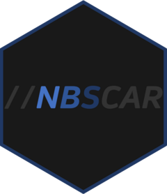

# nbscar 

<!-- badges: start -->
[](https://www.tidyverse.org/lifecycle/#experimental)
[](https://CRAN.R-project.org/package=nbscar)
<!-- badges: end -->

nbscar is an R package for interfacing with the TN NBS system. It uses the
[webdriver](https://github.com/rstudio/webdriver) package to programmatically
operate the NBS UI. This package is primarily designed for use within the
Shelby County Health Department, but contributions and modifications for use in
other settings are welcome.

## Installation

You can install the development version of nbscar with:

``` r
# install.packages('remotes')
remotes::install_github('jesse-smith/nbscar')
```

## Code of Conduct
  
Please note that the nbscar project is released with a [Contributor Code of Conduct](https://contributor-covenant.org/version/2/0/CODE_OF_CONDUCT.html).
By contributing to this project, you agree to abide by its terms.
